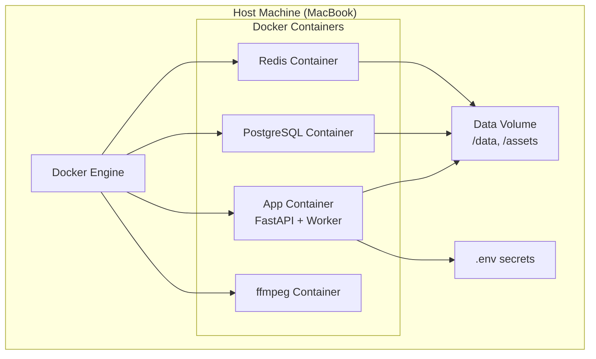
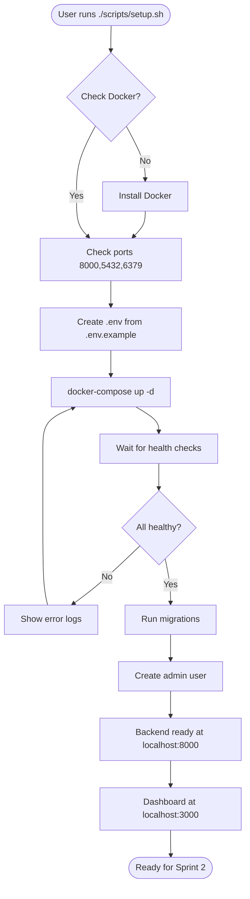

## File 2: `OpenClaw_LkkViber_Epic1_1.1.md`

```markdown
# OpenClaw – Epic 1: Core Architecture & Infrastructure (v1.1)

## Sprint 1 Focus
**Duration:** 2 weeks  
**Goal:** Establish a secure, modular foundation that enables all subsequent epics.

---

## 🧩 Epic 1 Stories

| Story ID | Description |
|----------|-------------|
| 1.1 | Monorepo Structure |
| 1.2 | Docker Sandbox for MacBook |
| 1.3 | Environment & Secrets Management |
| 1.4 | Centralized Logging |
| 1.5 | Base README & Setup Script |

---

## 📊 Block Diagram – Epic 1 Components



---

## 🔄 Flow Chart – Setup & First Run



---

## 🎯 Sprint 1 Joblist (Detailed)

These are the actionable tasks for Replit coding. Each job should be implemented sequentially.

### J1.1 – Monorepo Structure

**Acceptance Criteria:**
- Folder tree matches PRD (backend/, frontend/, docker/, scripts/, data/, tests/, docs/)
- `backend/requirements.txt` includes FastAPI, SQLAlchemy, Pydantic, python-dotenv, etc.
- `frontend/package.json` includes Next.js, React, TailwindCSS (optional)
- `docker/` contains `app.Dockerfile`, `worker.Dockerfile`, `docker-compose.yml`

**Replit Prompt:**  
*“Create a monorepo for OpenClaw with the exact folder structure from the PRD. Initialize a FastAPI backend in `/backend` with a simple health endpoint. Initialize a Next.js frontend in `/frontend`. Add Dockerfile for app and worker, and a docker-compose.yml that references them.”*

---

### J1.2 – Docker Sandbox for MacBook

**Acceptance Criteria:**
- `docker-compose.yml` defines services: `app`, `worker`, `postgres`, `redis`, `ffmpeg`
- `app` and `worker` use the same base image (Python 3.11)
- `ffmpeg` uses `jrottenberg/ffmpeg` or a custom image with ffmpeg installed
- Volumes: `./data:/data`, `./assets:/assets` (host directories are mounted read-write)
- No host root mounts (e.g., `/:/host`)
- All containers run in a user‑defined network

**Replit Prompt:**  
*“Create a Docker Compose setup for OpenClaw with five services: app, worker, postgres, redis, ffmpeg. Ensure that only necessary directories (/data, /assets) are mounted from the host. The app and worker should be able to communicate with postgres and redis. Write health checks for each service.”*

---

### J1.3 – Environment & Secrets Management

**Acceptance Criteria:**
- `.env.example` contains all required keys (e.g., `DATABASE_URL`, `REDIS_URL`, `SECRET_KEY`, `OPENAI_API_KEY`)
- Backend loads variables using `python-dotenv`
- Startup validates required keys; if missing, logs a clear error and exits
- No secrets are hardcoded in source files

**Replit Prompt:**  
*“Implement environment variable management for the FastAPI backend. Create a .env.example file with all necessary variables. Add a config.py that loads these variables and validates their presence. On startup, if any required variable is missing, log a clear error and exit with non‑zero code.”*

---

### J1.4 – Centralized Logging

**Acceptance Criteria:**
- Structured JSON logs (timestamp, level, message, module, trace_id)
- Log rotation (7 days, 100 MB max)
- All services (app, worker) use the same logging format
- Logs are written to stdout (for Docker) and optionally to a file

**Replit Prompt:**  
*“Add a logging utility in /backend/app/core/logging.py that outputs JSON logs. It should include request_id for tracking across services. Configure the logger to rotate after 100MB and keep 7 days of logs. Update the app and worker to use this logger instead of print.”*

---

### J1.5 – Base README & Setup Script

**Acceptance Criteria:**
- `README.md` explains the project, prerequisites (Docker, ports), and setup steps
- `./scripts/setup.sh` is executable and checks:
  - Docker installed and running
  - Ports 8000, 5432, 6379 available
- It creates `.env` from `.env.example` if not present
- It runs `docker-compose up -d` and waits for services to be healthy
- It runs database migrations (alembic)
- It prints success message with URLs

**Replit Prompt:**  
*“Create a README.md with clear instructions. Write a setup.sh script that checks for Docker, required ports, copies .env.example to .env if missing, then runs docker-compose up -d. Add a check for container health and print the backend and frontend URLs after success.”*

---

## ✅ Sprint 1 Success Metrics

- All five stories are implemented and tested.
- `./scripts/setup.sh` runs without errors on a clean machine.
- `docker-compose ps` shows all containers healthy.
- API endpoint `http://localhost:8000/health` returns `{"status": "ok"}`.
- Dashboard runs at `http://localhost:3000`.

---

## 🚀 Next Steps After Sprint 1

Once Epic 1 is complete, proceed to **Epic 2: Workflow Engine** – building the task queue and scheduler.

---

*Prepared for Replit implementation – 2026-03-31*
```

These files are ready to be used as the basis for Replit agent prompts and development tracking. The joblist provides a comprehensive view of all stories, while the Epic 1 document gives a focused, actionable plan for the first sprint.