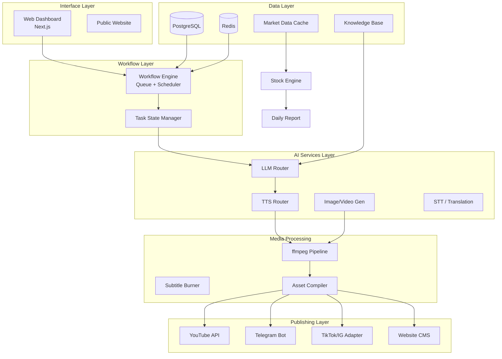
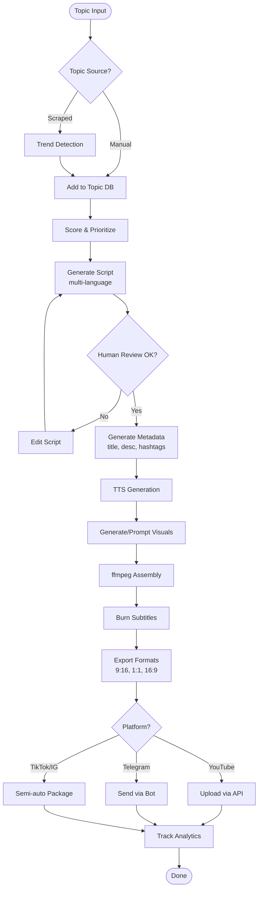

# **Product Requirements Document (PRD) – OpenClaw LkkViber**

### **Change Log**

| Date | Version | Description | Author |
|------|---------|-------------|--------|
| 2026-03-28 | 0.99.0 | Initial idea | LKK Viber |
| 2026-03-29 | 1.00.0 | Created by BMAD Method | BMAD PM agent |
| 2026-03-30 | 1.10.0 | Full PRD with structure, diagrams, acceptance criteria, and enhanced requirements | Product Owner |

This PRD v1.10.0 consolidates all previous specifications, adds project structure, block/flow diagrams, technology stack, and integrates fundamental skills and use cases. It follows the comprehensive format of the Family Expense Tracker PRD with enhanced acceptance criteria, performance benchmarks, and error handling.

---

## **🎯 Vision**

OpenClaw is a **secure, scalable, AI-driven content production and research automation system** that enables:

- **AI short video production** for categories: Ping Shuai Gong (平甩功), senior wellness, life philosophy, extraordinary abilities, past lives, hot topics, and coding experience.
- **TV series / story content** development, especially “Past Lives” (前世今生) with Eastern and Western versions.
- **Daily stock proposed lists** for TW and US markets using the proprietary 102.5 theory (MA crossovers + pivot points).
- **Multi-platform publishing automation** across YouTube Shorts, TikTok, Instagram Reels, Telegram, and more.
- **Secure local execution** via Docker sandbox on MacBook.
- **Cost-effective AI provider routing** leveraging China solutions for token cost diversification.

---

## **❓ Problem Statement**

Current challenges addressed by OpenClaw:

| Problem | Impact |
|---------|--------|
| Manual video production | Slow, unscalable, inconsistent quality |
| Fragmented tools (script, video, publish) | No unified workflow, low reusability |
| Uncontrolled API costs | Expensive LLM calls without routing/caching |
| Security risks | AI agents may access host files; API key exposure |
| Multi-platform friction | Inconsistent APIs, manual upload overhead |
| No standardized content pipeline | Ideas lost, production bottlenecks |

---

## **👥 Target Users**

### Primary
- Individual content creators (YouTube/TikTok)
- Automated content operators
- AI workflow builders

### Secondary
- Stock analysis content creators
- Story/series creators
- Self-media studios

---

## **💎 Core Value Proposition**

1. **Build Once, Use Everywhere** – One script becomes short video, article, social post, website page, newsletter.
2. **AI Automation Engine** – From idea to publish, fully automated.
3. **Secure by Design** – Docker sandbox protects host system.
4. **Cost-Optimized AI Routing** – Smart selection of cheapest/best provider per task.
5. **Modular & Extensible** – Easy to add new platforms, content types, or AI models.

---

## **📁 Project Structure (Tree)**

```
OpenClaw/
├── .github/
│   └── workflows/
├── docker/
│   ├── app.Dockerfile
│   ├── worker.Dockerfile
│   └── docker-compose.yml
├── backend/
│   ├── app/
│   │   ├── api/
│   │   │   ├── v1/
│   │   │   │   ├── content.py
│   │   │   │   ├── workflow.py
│   │   │   │   ├── publish.py
│   │   │   │   └── stock.py
│   │   ├── core/
│   │   │   ├── config.py
│   │   │   ├── security.py
│   │   │   └── logging.py
│   │   ├── models/
│   │   │   ├── job.py
│   │   │   ├── script.py
│   │   │   ├── topic.py
│   │   │   └── stock_signal.py
│   │   ├── services/
│   │   │   ├── workflow_engine/
│   │   │   ├── content_engine/
│   │   │   ├── video_pipeline/
│   │   │   ├── publishing_hub/
│   │   │   ├── stock_engine/
│   │   │   └── story_engine/
│   │   ├── providers/
│   │   │   ├── text/
│   │   │   ├── tts/
│   │   │   ├── image/
│   │   │   └── video/
│   │   └── utils/
│   └── requirements.txt
├── frontend/
│   ├── app/               # Next.js 14+ App Router
│   ├── components/
│   ├── lib/
│   └── package.json
├── scripts/
│   ├── setup.sh
│   ├── reset_docker.sh
│   └── backup.sh
├── data/
│   ├── knowledge_base/
│   ├── transcripts/
│   └── assets/
├── tests/
├── docs/
├── .env.example
├── README.md
└── LICENSE
```

---

## **📊 Project Block Diagram (Mermaid)**



---

## **🔄 Project Flowchart (Mermaid) – Short Video Pipeline**



---

## **📱 Technology Stack Table**

| Layer | Technology | Purpose |
|-------|------------|---------|
| **Backend** | Python FastAPI | REST API, async support |
| **Frontend** | Next.js 14 + React | Admin dashboard, public website |
| **Database** | PostgreSQL / Supabase | Primary data storage |
| **Queue** | Redis + RQ/Celery | Task queue, scheduler |
| **Media** | ffmpeg (via Docker) | Video assembly, subtitle burn |
| **Automation** | Playwright | Scraping, headless browser tasks |
| **AI Providers** | Adapter pattern: OpenAI, Anthropic, Minimax, GLM-4, DeepSeek, etc. | Text, TTS, image, video |
| **Local Sandbox** | Docker Compose | Isolated containers on MacBook |
| **Auth** | JWT + optional OAuth | Secure access |
| **Logging** | ELK or simple JSON logs | Audit, debugging |
| **Deployment** | Docker + (optional) cloud | Replit prototyping, local production |

---

## **🗂 Epics & Stories by Module**

> **Note:** Each story includes enhanced acceptance criteria: error handling, performance benchmarks, and analytics tracking where applicable.

---

### **🟦 Epic 1: Core Architecture & Infrastructure (High Priority)**

**Goal:** Establish secure, modular foundation.

- **Story 1.1 – Monorepo Structure**
  - **Acceptance Criteria:**
    - Folder structure as defined in project tree
    - `README.md` with setup instructions
    - `docker-compose.yml` runs all services
    - Performance: `docker-compose up` in <30s
    - Analytics: track repo setup completion
- **Story 1.2 – Docker Sandbox for MacBook**
  - **Acceptance Criteria:**
    - Containers: app, worker, postgres, redis, ffmpeg
    - No host root mounts; only `/data` and `/assets`
    - Secrets via `.env`, not hardcoded
    - Reset script restores clean state
    - Error handling: container health checks
    - Performance: container start in <10s
- **Story 1.3 – Environment & Secrets Management**
  - **Acceptance Criteria:**
    - `.env.example` with all required keys
    - Validation on startup (missing keys → graceful error)
    - No secrets logged
- **Story 1.4 – Centralized Logging**
  - **Acceptance Criteria:**
    - Structured JSON logs
    - Log rotation and retention (7 days)
    - Error level filtering
    - Performance: log write <10ms
- **Story 1.5 – Base README & Setup Script**
  - **Acceptance Criteria:**
    - One-command setup (`./scripts/setup.sh`)
    - Checks Docker, ports, dependencies
    - Clear error messages for missing prerequisites

---

### **🟩 Epic 2: Workflow Engine (Core Brain)**

**Goal:** Orchestrate all automation tasks.

- **Story 2.1 – Task Queue (Redis + Worker)**
  - **Acceptance Criteria:**
    - Job enqueue/dequeue with priority
    - Retry logic (exponential backoff, max 3 retries)
    - Dead-letter queue for failed jobs
    - Performance: enqueue <50ms, dequeue <100ms
    - Analytics: queue length, success/failure rate
- **Story 2.2 – Job Model (Status / Retry)**
  - **Acceptance Criteria:**
    - States: pending, running, completed, failed, retrying
    - Each job stores input/output metadata
    - Error handling: job timeout (configurable)
- **Story 2.3 – Workflow Definition (JSON/YAML)**
  - **Acceptance Criteria:**
    - DAG support (steps with dependencies)
    - Validation on definition load
    - Example: `topic → script → render → publish`
- **Story 2.4 – Scheduler (Cron / Trigger)**
  - **Acceptance Criteria:**
    - Schedule recurring jobs (daily stock report, weekly cleanup)
    - Manual trigger via API
    - Error handling: missed schedule detection
- **Story 2.5 – Workflow API (FastAPI)**
  - **Acceptance Criteria:**
    - Endpoints: create job, get status, list workflows
    - Authentication required
    - Performance: API response <200ms p95

---

### **🟨 Epic 3: Content Engine (AI Script & Metadata)**

**Goal:** Generate scripts and packaging metadata.

- **Story 3.1 – Topic Collector**
  - **Acceptance Criteria:**
    - Manual form + optional scraping (YouTube/TikTok trends)
    - Categories: 平甩功, 老人養生, 人生哲理, 特異功能, 前世今生, hot topics, coding
    - Scoring system (trend score, monetization potential)
    - Error handling: scraper rate limits, fallback to manual
    - Performance: topic save <200ms
- **Story 3.2 – Script Generator (Multi-language)**
  - **Acceptance Criteria:**
    - Supports Traditional Chinese, Simplified Chinese, English
    - Tone presets: serious, spiritual, elderly-friendly, viral hook
    - Output lengths: 30s, 60s, 90s scripts
    - Prompt templates stored in DB
    - Error handling: LLM API failure → retry with backup provider
    - Performance: script generation <15s
- **Story 3.3 – Hook & CTA Generator**
  - **Acceptance Criteria:**
    - Generate 3 hook variations per script
    - Generate call-to-action (subscribe, comment, website)
    - Localized hooks per language
- **Story 3.4 – Version Control for Scripts**
  - **Acceptance Criteria:**
    - Each edit creates new version
    - Rollback to any previous version
    - Diff view in admin dashboard
- **Story 3.5 – Metadata Packaging Engine**
  - **Acceptance Criteria:**
    - Title (max 100 chars), description (5000 chars), hashtags (15 tags)
    - Thumbnail text overlay prompt
    - SEO keyword suggestions
    - Performance: metadata generation <5s

---

### **🟥 Epic 4: Video Pipeline (Automated Production)**

**Goal:** Turn scripts into ready-to-publish videos.

- **Story 4.1 – TTS Service Wrapper**
  - **Acceptance Criteria:**
    - Adapter for multiple TTS providers (Edge, ElevenLabs, MiniMax, local)
    - Voice selection per language/gender
    - Error handling: provider failure → fallback to next
    - Performance: TTS <30s for 90s script
- **Story 4.2 – Visual Asset Generator**
  - **Acceptance Criteria:**
    - Generate image prompts from script (scene by scene)
    - Optional: stock asset library fallback
    - Error handling: image generation fails → use placeholder
- **Story 4.3 – ffmpeg Assembly Pipeline**
  - **Acceptance Criteria:**
    - Combine TTS audio + images/video clips
    - Output formats: 9:16 (vertical), 1:1 (square), 16:9 (horizontal)
    - Background music (optional, copyright-free)
    - Error handling: ffmpeg error → retry with lower resolution
    - Performance: 60s video render <2min on MacBook
- **Story 4.4 – Subtitle Generator & Burner**
  - **Acceptance Criteria:**
    - Auto-transcribe TTS (or use forced alignment)
    - Burn subtitles into video (customizable font, color, position)
    - SRT file export
    - Performance: subtitle burn adds <20% to render time
- **Story 4.5 – Format Exporter & Queue**
  - **Acceptance Criteria:**
    - Export to platform-specific resolutions (e.g., YouTube Shorts: 1080x1920)
    - Queue multiple format exports from one master

---

### **🟪 Epic 5: Publishing Hub**

**Goal:** Multi-platform distribution.

- **Story 5.1 – YouTube Uploader (API)**
  - **Acceptance Criteria:**
    - OAuth2 authentication for channel
    - Upload with title, description, tags, thumbnail
    - Schedule publish time
    - Error handling: quota exceeded → notify admin
    - Performance: upload <5min for 60MB video
- **Story 5.2 – Telegram Publisher**
  - **Acceptance Criteria:**
    - Send video to channel or group
    - Caption with metadata
    - Error handling: bot token invalid → alert
- **Story 5.3 – Metadata Mapping System**
  - **Acceptance Criteria:**
    - Platform-specific field mapping (YouTube: tags, TikTok: music)
    - Template per platform
- **Story 5.4 – Publish Status Tracking**
  - **Acceptance Criteria:**
    - Dashboard shows pending, success, failed per platform
    - Retry failed publishes
- **Story 5.5 – Manual Fallback Uploader UI**
  - **Acceptance Criteria:**
    - For platforms without API (e.g., Douyin, Xiaohongshu)
    - Generate downloadable package: video + caption + hashtags + cover image
    - One-click copy to clipboard

---

### **🟫 Epic 6: Stock Engine (102.5 Theory)**

**Goal:** Daily stock analysis and report generation.

- **Story 6.1 – TW/US Market Data Fetcher**
  - **Acceptance Criteria:**
    - TW market: yfinance alternative or API (e.g., FinMind)
    - US market: yfinance
    - Daily update job (after market close)
    - Error handling: data source failure → cache last known
    - Performance: full refresh <5min
- **Story 6.2 – Moving Average Calculator**
  - **Acceptance Criteria:**
    - Weekly: 2, 10, 26 MA
    - Daily: 2, 10, 50, 132 MA
    - Store results in DB for fast access
- **Story 6.3 – Crossover & Pivot Detection**
  - **Acceptance Criteria:**
    - Detect MA crossovers (above/below)
    - Detect pivot points (high/low swing)
    - Score each signal (strength 0-100)
- **Story 6.4 – Ranking Logic**
  - **Acceptance Criteria:**
    - Rank stocks by signal strength and volume
    - Top 10 TW, Top 10 US daily
    - Include explanation (e.g., “2/10 weekly crossover + pivot low”)
- **Story 6.5 – Daily Report Generator**
  - **Acceptance Criteria:**
    - Human-readable report (markdown, PDF, JSON)
    - Chart snapshots (matplotlib or Plotly)
    - Disclaimers: “Not financial advice”
    - Performance: report generation <10s

---

### **⬛ Epic 7: Admin Dashboard**

**Goal:** Centralized control and monitoring.

- **Story 7.1 – Basic UI (Next.js)**
  - **Acceptance Criteria:**
    - Login protected
    - Sidebar navigation: Content, Stock, Publish, Analytics
    - Responsive (mobile, tablet, desktop)
- **Story 7.2 – Job Monitor**
  - **Acceptance Criteria:**
    - Real-time job queue status (pending, running, failed)
    - Cancel or retry job
    - Filter by workflow type
- **Story 7.3 – Script Editor**
  - **Acceptance Criteria:**
    - WYSIWYG editor with version history
    - Trigger regeneration from script
- **Story 7.4 – Publish Dashboard**
  - **Acceptance Criteria:**
    - Calendar view of scheduled publishes
    - Manual publish button
    - Platform filter
- **Story 7.5 – Stock Dashboard**
  - **Acceptance Criteria:**
    - Display daily top opportunities
    - Chart view with MA lines
    - Export report button

---

### **🟧 Epic 8: Story Engine (前世今生)**

**Goal:** Develop episodic content.

- **Story 8.1 – Story Bible Schema**
  - **Acceptance Criteria:**
    - World, characters, timeline, cultural notes
    - Eastern and Western versions
- **Story 8.2 – Episode Generator**
  - **Acceptance Criteria:**
    - Generate 5-episode arcs from bible
    - Act structure (setup, confrontation, resolution)
- **Story 8.3 – Character Consistency System**
  - **Acceptance Criteria:**
    - Character profiles for AI (traits, dialogue style)
    - Avoid contradictions across episodes
- **Story 8.4 – Storyboard Generator**
  - **Acceptance Criteria:**
    - Scene-by-scene visual prompts
    - Camera angle suggestions
    - Export to video pipeline

---

### **🟩 Epic 9: Multi-Language & RWD (System-Wide)**

**Goal:** Global usability.

- **Story 9.1 – Language Support (5 languages)**
  - **Acceptance Criteria:**
    - EN, ZH-TW, ZH-CN, JA, ES
    - RTL/LTR handling
    - Error handling: missing translation → fallback to EN
- **Story 9.2 – Language Switcher**
  - **Acceptance Criteria:**
    - UI toggle, persists in localStorage
    - Performance: switch <1s
- **Story 9.3 – Responsive Web Design**
  - **Acceptance Criteria:**
    - No horizontal scroll on mobile
    - Touch-friendly buttons (min 44x44pt)
    - Performance: Lighthouse >90 on mobile

---

### **🟥 Epic 10: Advanced Notifications & Security**

**Goal:** Keep users informed and data safe.

- **Story 10.1 – Push Notifications**
  - **Acceptance Criteria:**
    - Browser push for job completion, stock alerts
    - Configurable per user
- **Story 10.2 – Parental / Approval Controls**
  - **Acceptance Criteria:**
    - For family groups: approve child’s expenses (if integrated)
    - Not required for MVP but designed for extension
- **Story 10.3 – Data Security & Compliance**
  - **Acceptance Criteria:**
    - GDPR/CCPA ready (data export, delete)
    - API keys encrypted at rest
    - No plaintext secrets in logs

---

## **📅 Epic Dependency Mapping**

| Epic | Depends On | Description |
|------|------------|-------------|
| Epic 1 | None | Foundation infrastructure |
| Epic 2 | Epic 1 | Workflow engine needs Docker/db |
| Epic 3 | Epic 2 | Content engine uses workflows |
| Epic 4 | Epic 3 | Video pipeline needs scripts |
| Epic 5 | Epic 4, Epic 2 | Publishing uses rendered videos |
| Epic 6 | Epic 1, Epic 2 | Stock engine needs data & scheduling |
| Epic 7 | Epic 1, Epic 2, Epic 3, Epic 4, Epic 5, Epic 6 | Dashboard aggregates all |
| Epic 8 | Epic 3 | Story engine builds on content engine |
| Epic 9 | Epic 1 | Multi-language is cross-cutting |
| Epic 10 | Epic 2, Epic 5 | Notifications and security |

---

## **🛣️ Release Roadmap (5 Months)**

| Sprint | Duration | Focus | Epics |
|--------|----------|-------|-------|
| Sprint 1 | Week 1-2 | Foundation | Epic 1 (Architecture + Docker) |
| Sprint 2 | Week 3-4 | Workflow & Dashboard Skeleton | Epic 2, Epic 7 (basic) |
| Sprint 3 | Week 5-6 | Content Engine | Epic 3 (topic, script, metadata) |
| Sprint 4 | Week 7-8 | Video Pipeline v1 | Epic 4 (TTS, ffmpeg, subtitles) |
| Sprint 5 | Week 9-10 | Publishing Hub | Epic 5 (YouTube, Telegram) |
| Sprint 6 | Week 11-12 | Stock Engine | Epic 6 (data, signals, report) |
| Sprint 7 | Week 13-14 | Multi-language & RWD | Epic 9 |
| Sprint 8 | Week 15-16 | Story Engine (MVP) | Epic 8 (bible, episode) |
| Sprint 9 | Week 17-18 | Advanced Dashboard & Analytics | Epic 7 (full) |
| Sprint 10 | Week 19-20 | Security, Notifications, Optimization | Epic 10, provider routing, cost tuning |

---

## **🧠 Fundamental Skills & Protocols (from Use Cases)**

The following fundamental capabilities are embedded into OpenClaw design:

### 10 Core Skills
1. **skill-vetting** – Evaluate and approve new AI skills before integration.
2. **self-improving-agent** – Agent learns from past task outcomes (success/failure).
3. **tavily-search** – Real-time web search for trend detection.
4. **summarize** – Condense long articles or transcripts into key points.
5. **tavily+summary** – Combined search + summarization for research.
6. **find-skills** – Discover and import skills from community (e.g., vercel/skills.sh).
7. **using-superpower** – Meta-cognition for agent to choose best tool.
8. **vercel-react-best-practices** – Frontend patterns for Next.js.
9. **frontend-design (Anthropic)** – UI generation guidelines.
10. **github** – Version control and CI/CD integration.
11. **agent-browser** – Automated browser interaction for scraping.

### Fundamental Protocols
- **Self-Improvement** – Agents refine their own prompts and workflows.
- **EvoMap Collaborative** – Shared memory across agents.
- **MEMOS Tensor Memory** – Long-term memory for facts, user preferences.

### Key Use Cases Leveraged
- **Personal Second Brain** – OpenClaw indexes all generated content, scripts, stock reports for searchable retrieval.
- **Custom Morning Brief** – Scheduled daily email/Telegram with AI news, content ideas, to-do list.
- **Autonomous Content Factory** – Discord-integrated multi-agent system (research agent, script agent, thumbnail agent).
- **Market Opportunity Research** – Reddit/X scraping for pain points → software ideas.
- **Goal-Oriented Task Execution** – After brain dump, OpenClaw generates daily tasks and executes them.
- **Custom "Mission Control" Software** – Replaces multiple SaaS tools with unified Next.js dashboard.

---

## **📊 Success Metrics**

| Metric | Target | Measurement |
|--------|--------|-------------|
| Daily video output | ≥5 shorts/day | Database count |
| Publish success rate | ≥95% | Platform API responses |
| Average cost per video | ≤$0.10 | Provider logs |
| Workflow task success | ≥98% | Job status |
| Dashboard load time | <2s | Lighthouse |
| Stock report accuracy | No false crossover | Manual QA weekly |
| User satisfaction (pilot) | ≥4/5 | Survey |

---

## **⚠️ Risks & Mitigation**

| Risk | Probability | Impact | Mitigation |
|------|-------------|--------|------------|
| LLM API downtime | Medium | High | Multi-provider fallback, local cache |
| Cost overrun | Medium | Medium | Provider routing (cheap mode), usage alerts |
| Platform API changes | Medium | Medium | Semi-auto fallback UI for critical platforms |
| Content copyright claims | Low | High | Use only original or licensed assets; disclaimers |
| Security breach | Low | Critical | Docker sandbox, encrypted secrets, regular audits |
| Health/stock compliance | Medium | High | Disclaimers, human review before publish |

---

## **🔮 Future Expansion**

- Local LLM (Ollama) for offline script generation
- A/B title/thumbnail testing automation
- Fully autonomous YouTube channel (no human review)
- SaaS multi-tenant version of OpenClaw
- Integration with family expense tracker (合并两个系统)

---

## **✅ Conclusion**

OpenClaw LkkViber v1.10.0 is a **secure, modular, cost-optimized AI content factory** that transforms ideas into published videos and stock reports with minimal human intervention. By leveraging Docker sandboxing, provider routing, and a rich set of fundamental skills, it delivers high ROI on Replit token quota while maintaining extensibility for future growth.

**Next Step:** Begin Sprint 1 – implement Epic 1 (Core Architecture & Docker Sandbox). Use the provided job tickets in `OpenClaw_for_replit_joblist.txt` as actionable prompts for Replit Agent.